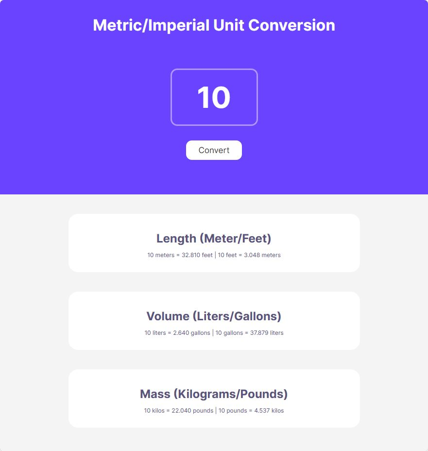

# Unit Converter



A simple and versatile Imperial/Metric Unit Converter that allows you to seamlessly convert between different units of measurement.

## Table of Contents

- [Description](#description)
- [Features](#features)
- [Getting Started](#getting-started)

## Description

The Unit Converter is designed to assist you in converting various types of units, including length, weight, temperature, and more. Whether you work with imperial or metric units, this tool makes it easy to perform accurate conversions for your specific needs.

## Features

- **Intuitive Interface**: User-friendly design for effortless navigation and quick conversions.
- **Multiple Unit Categories**: Convert length, volume, and mass with just a few clicks.
- **Bidirectional Conversion**: Switch between imperial and metric units easily.
- **Real-time Results**: Instantly see the converted value as you input the original value.

## Getting Started

To use the Unit Converter, follow these steps:

1. Clone the repository:

   ```bash
   git clone https://github.com/your-username/unit-converter.git
